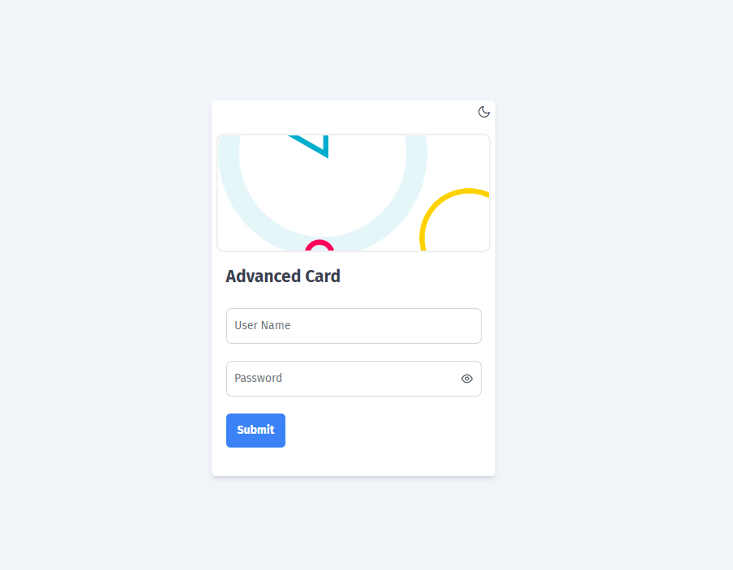
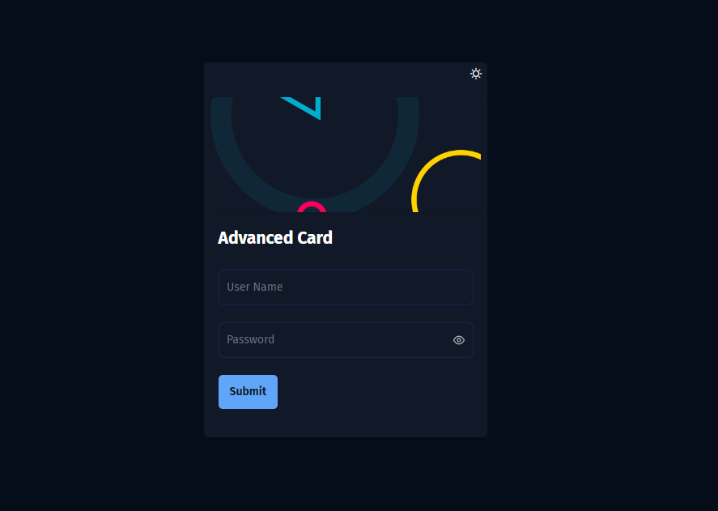
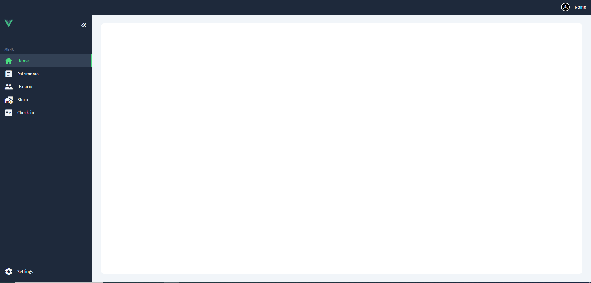
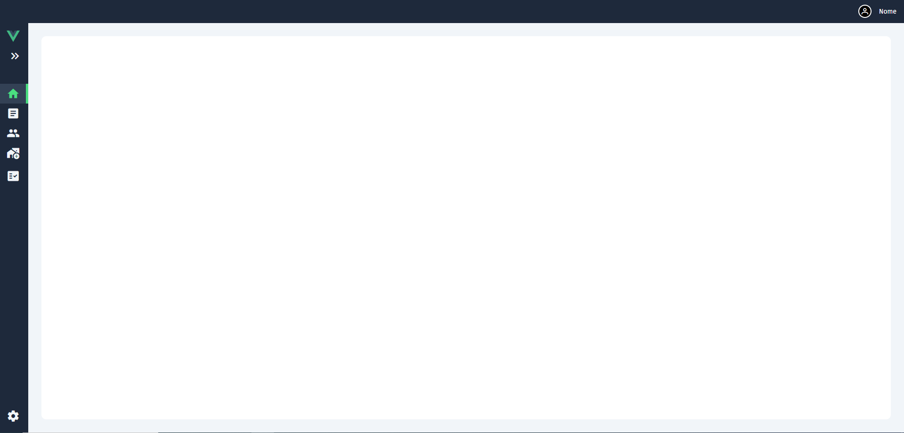
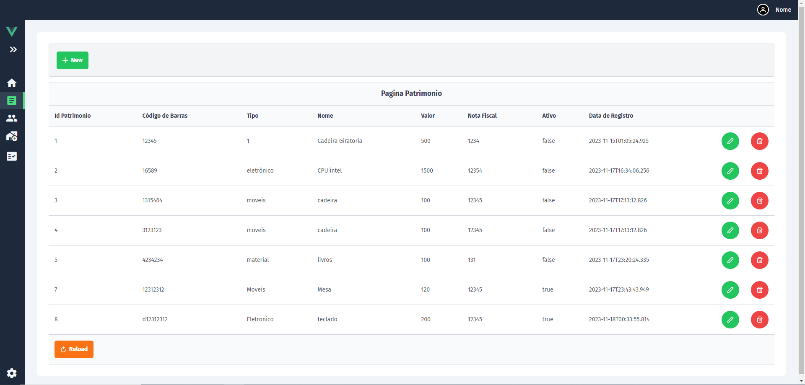
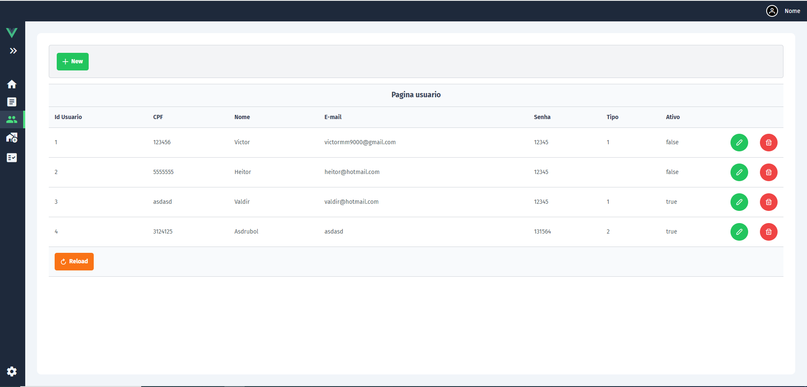
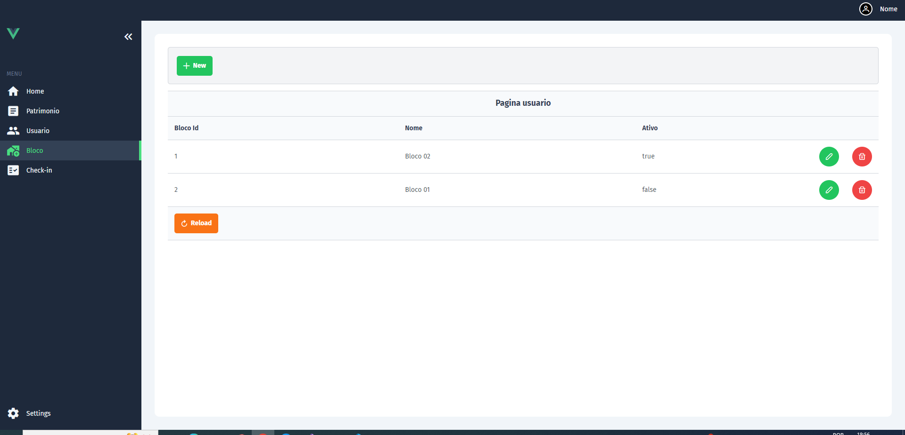

# Front-end Projeto Controle Patrimonial

Neste projeto, desenvolvemos um software para o controle patrimonial de uma empresa, visando facilitar e agilizar o processo do balanço patrimonial.

## Regras de Negócio

Se um patrimônio não estiver cadastrado, o usuário deverá cadastrá-lo e etiquetá-lo. Além disso, o usuário deverá realizar o check-in de todos os patrimônios pelo menos uma vez por ano.

## Recommended IDE Setup

[VSCode](https://code.visualstudio.com/) + [Volar](https://marketplace.visualstudio.com/items?itemName=Vue.volar) (and disable Vetur) + [TypeScript Vue Plugin (Volar)](https://marketplace.visualstudio.com/items?itemName=Vue.vscode-typescript-vue-plugin).

## Paginas do Projeto

### Login




### Sidebar




### Patrimônio



### Usuário



### Bloco



## Customize configuration

See [Vite Configuration Reference](https://vitejs.dev/config/).

## Project Setup

```sh
npm install
```

### Compile and Hot-Reload for Development

```sh
npm run dev
```

### Compile and Minify for Production

```sh
npm run build
```
# VueFrontPatrimonio

Esse projeto foi desenvolvido em Vue.js